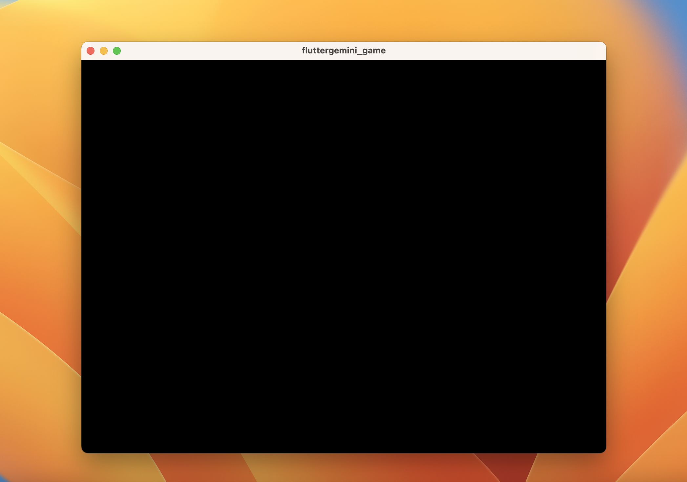
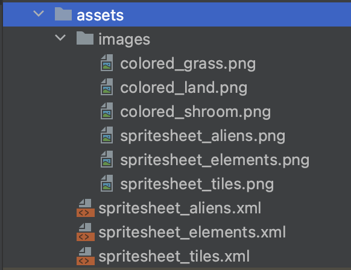
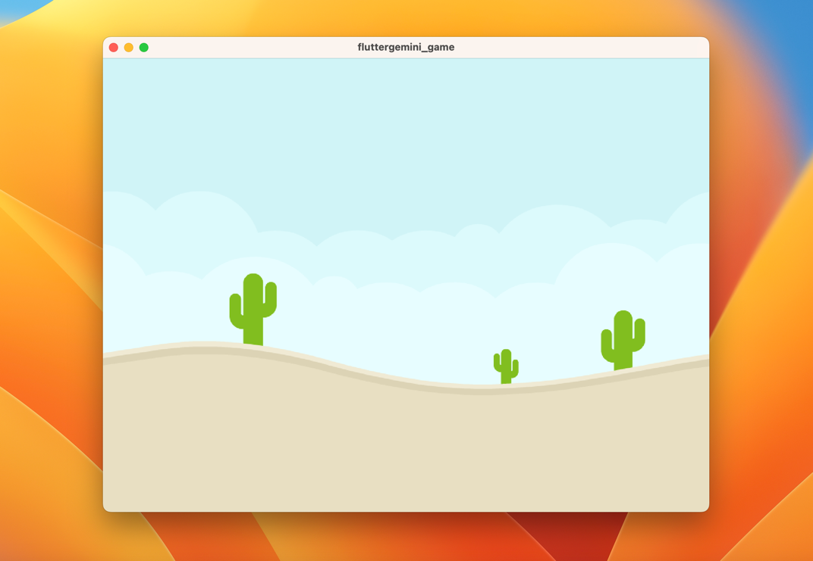

# fluttergemini_game

# Welcome to my Talk Assita

### Step 1

In your terminal, create a new Flutter project by running the following commands:

    $ flutter create --empty fluttergemini_game

Install the dependencies into your project

    $ cd fluttergemini_game
    $ flutter pub add characters flame flame_forge2d xml google_generative_ai

### Step 1.1

Clear everything in your `main.dart` and then add this..

```dart
import 'package:flame/game.dart';
import 'package:flutter/material.dart';

void main() {
  runApp(
    const GameWidget.controlled(
      gameFactory: FlameGame.new,
    ),
  );
}
```

Go ahead and run the code.


This should be your result.

### Step 2

Adding the image assets

Download the physics assets from Kenney.nl:

https://kenney.nl/assets/physics-assets

After downloading the images assets, we will proceed to add the following files into our app.

Next, create a new folder in the root directory called assets and add the following files..



And finally, in your `pubspec.yaml` file add the assest path

```yaml
flutter:
  uses-material-design: true
  # To add assets to your application, add an assets section, like this:
  assets:
    - assets/
    - assets/images/
```

**Note:** Don't forget to run `flutter pub get` after adding the images and assets path.

### Step 3

Components

In Flutter everything is a Widget, while in Flame everything is a component

A component is a fundamental building block used to create various game elements.

Components are objects that represent entities in the game world and can be used to manage the game's visual elements, logic, and behaviors.

**Types of Components in Flame**

Flame provides several types of components to cover different use cases:

**PositionComponent:** A base component that has position, size, and angle.

**SpriteComponent:** A component that renders a sprite image.

**BodyComponent (Forge2D):** A component used for physics-based games when using the Forge2D plugin.

And More...

### Step 4: Adding the ground

In lib folder, create a new directory and name it `components`.

In the components folder, create a new file and name it `background.dart`.

```dart
import 'dart:math';
import 'package:flame/components.dart';
import 'game.dart';

class Background extends SpriteComponent with HasGameReference<MyPhysicsGame> {
  Background({required super.sprite})
      : super(
          anchor: Anchor.center,
          position: Vector2(0, 0),
        );

  @override
  void onMount() {
    super.onMount();
    size = Vector2.all(max(
      game.camera.visibleWorldRect.width,
      game.camera.visibleWorldRect.height,
    ));
  }
}

```

Next, were going to add the background to our game.

In the `game.dart` file, add the following code.

```dart
// Step 4 codes
import 'dart:async';
import 'dart:ui' as ui;

import 'package:flame/components.dart';
import 'package:flame/extensions.dart';
import 'package:flame_forge2d/forge2d_game.dart';
import 'package:flutter/services.dart';
import 'package:xml/xml.dart';
import 'package:xml/xpath.dart';

import 'background.dart';

class MyPhysicsGame extends Forge2DGame {
  MyPhysicsGame()
      : super(
          gravity: Vector2(0, 10),
          camera: CameraComponent.withFixedResolution(width: 800, height: 600),
        );

  late final XmlSpriteSheet aliens;
  late final XmlSpriteSheet elements;
  late final XmlSpriteSheet tiles;

  @override
  FutureOr<void> onLoad() async {
    final [backgroundImage, aliensImage, elementsImage, tilesImage] = await [
      images.load('colored_desert.png'),
      images.load('spritesheet_aliens.png'),
      images.load('spritesheet_elements.png'),
      images.load('spritesheet_tiles.png'),
    ].wait;

    aliens = XmlSpriteSheet(aliensImage,
        await rootBundle.loadString('assets/spritesheet_aliens.xml'));
    elements = XmlSpriteSheet(elementsImage,
        await rootBundle.loadString('assets/spritesheet_elements.xml'));
    tiles = XmlSpriteSheet(tilesImage,
        await rootBundle.loadString('assets/spritesheet_tiles.xml'));

    await world.add(Background(sprite: Sprite(backgroundImage)));

    return super.onLoad();
  }
}

class XmlSpriteSheet {
  XmlSpriteSheet(this.image, String xml) {
    final document = XmlDocument.parse(xml);
    for (final node in document.xpath('//TextureAtlas/SubTexture')) {
      final name = node.getAttribute('name')!;
      final x = double.parse(node.getAttribute('x')!);
      final y = double.parse(node.getAttribute('y')!);
      final width = double.parse(node.getAttribute('width')!);
      final height = double.parse(node.getAttribute('height')!);
      _rects[name] = Rect.fromLTWH(x, y, width, height);
    }
  }

  final ui.Image image;
  final _rects = <String, Rect>{};

  Sprite getSprite(String name) {
    final rect = _rects[name];
    if (rect == null) {
      throw ArgumentError('Sprite $name not found');
    }
    return Sprite(
      image,
      srcPosition: rect.topLeft.toVector2(),
      srcSize: rect.size.toVector2(),
    );
  }
}

```

And finally for this step, we will import the components game into our main.dart file.

```dart
import 'package:flame/game.dart';
import 'package:flutter/material.dart';

import 'components/game.dart';

void main() {
  runApp(
    const GameWidget.controlled(
      gameFactory: MyPhysicsGame.new,
    ),
  );
}
```

Now run the code and you should see the background image.



**Heads up..**

If we continue this way we might not finish this session in the next 2 hours.

So, here the finished project you can clone and let's skip to the most interesting part..

Adding Gemini to the codebase yahh!!!
